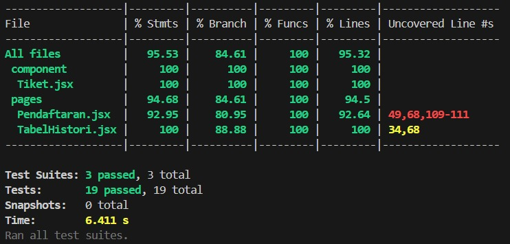

# Proyek Pengujian Perangkat Lunak: Sistem Manajemen Rumah Sakit

**Roles:**
- Muhammad Luthfi Attaqi (496427) --> Back-end Developer and White Box Tester
- Gavind Muhammad Pramahita (497221) --> UI/UX Engineer and Black Box Tester
- Ryan Krishandi Lukito (497249) --> Front-end Developer and White Box Tester

---

## ✅ User Requirements

| No  | User Requirement                   | Deskripsi                                                                 |
|-----|------------------------------------|---------------------------------------------------------------------------|
| UR1 | Pendaftaran Digital                | Pasien dapat mendaftar antrean melalui aplikasi.                          |
| UR2 | Pemilihan Spesialis dari Dokter   | Pasien dapat memilih spesialis bagian mana dari daftar dropdown.         |
| UR3 | Pemilihan Nama Dokter             | Pasien dapat memilih dokter dari daftar dropdown.                        |
| UR4 | Pemilihan Waktu                   | Pasien dapat memilih waktu kunjungan dari pilihan waktu yang tersedia.   |
| UR5 | Input Nama Pasien                 | Pasien harus mengisi nama dengan maksimal 50 karakter.                   |
| UR6 | Validasi Formulir                 | Sistem menolak pendaftaran jika nama pasien kosong, dan menampilkan pesan error. |
| UR7 | Nomor Antrian Otomatis            | Setelah mendaftar, pasien mendapatkan nomor antrian otomatis (misal: A001). |
| UR8 | Konfirmasi Pendaftaran            | Sistem menampilkan detail konfirmasi (nomor antrian, dokter, waktu, nama pasien). |
| UR9 | Persistensi Data                  | Data antrian tetap tersedia setelah halaman di-refresh.                  |

---

## 🧩 Feature Analysis

| Fitur                   | Deskripsi                                                                 | Terkait User Requirement |
|-------------------------|--------------------------------------------------------------------------|---------------------------|
| Halaman Formulir        | Terdapat halaman utama dengan form pendaftaran                           | UR1                       |
| Dropdown Spesialis      | Dropdown berisi pilihan Spesialis seperti "Spesialis Jantung"            | UR2                       |
| Dropdown Dokter         | Dropdown berisi pilihan seperti "Dr. Andi"                                | UR3                       |
| Dropdown Waktu          | Dropdown dengan pilihan jam seperti "09:00", "10:00"                      | UR4                       |
| Input Nama Pasien       | Kolom wajib diisi, maksimal 50 karakter                                  | UR5                       |
| Validasi Nama           | Jika kosong, muncul error: "Nama pasien wajib diisi"                     | UR6                       |
| Tombol "Daftar Antrian" | Menyimpan data dan menghasilkan nomor antrian                            | UR7                       |
| Konfirmasi Pendaftaran  | Menampilkan nomor antrian dan detail input                               | UR8                       |
| Penyimpanan Data Lokal  | Gunakan Local Storage atau database agar data tidak hilang saat refresh  | UR9                       |

---

## 🧪 End-to-End Testing (Acceptance Test)

| No  | Test Case                    | Langkah                                                                                                                                     | Expected Result                                                        | Terkait                     |
|-----|------------------------------|--------------------------------------------------------------------------------------------------------------------------------------------|------------------------------------------------------------------------|-----------------------------|
| TC1 | Berhasil daftar antrian     | 1. Buka halaman 2. Isi nama 3. Pilih spesialis 4. Pilih dokter 5. Pilih waktu 6. Klik "Daftar Antrian"                      | Muncul nomor antrian (misalnya A001), nama, dokter, dan waktu         | UR1, UR2, UR3, UR4, UR5, UR6, UR7 |
| TC2 | Validasi nama kosong        | 1. Buka halaman 2. Kosongkan nama 3. Pilih spesialis 4. Pilih dokter 5. Pilih waktu 6. Klik "Daftar Antrian"                 | Muncul pesan: "Nama pasien wajib diisi"                               | UR6                         |
| TC3 | Nama lebih dari 50 karakter | Isi nama dengan lebih dari 50 karakter                                                                                                     | Form tidak boleh submit, muncul error                                 | UR5                         |
| TC4 | Persistensi setelah refresh | Daftar antrean lalu refresh halaman                                                                                                        | Informasi antrean masih tampil                                        | UR9                         |
| TC5 | Nomor antrean bertambah     | Daftar dua kali dengan data berbeda                                                                                                        | Nomor antrean bertambah: A001, A002                                   | UR7                         |
| TC6 | Dokter dan waktu tampil     | Pilih "Dr. Budi - Spesialis Mata", waktu "10:00", lalu daftar                                                                              | Konfirmasi menampilkan dokter & waktu yang dipilih                    | UR2, UR3, UR4, UR8          |

---

## Coverage Test

